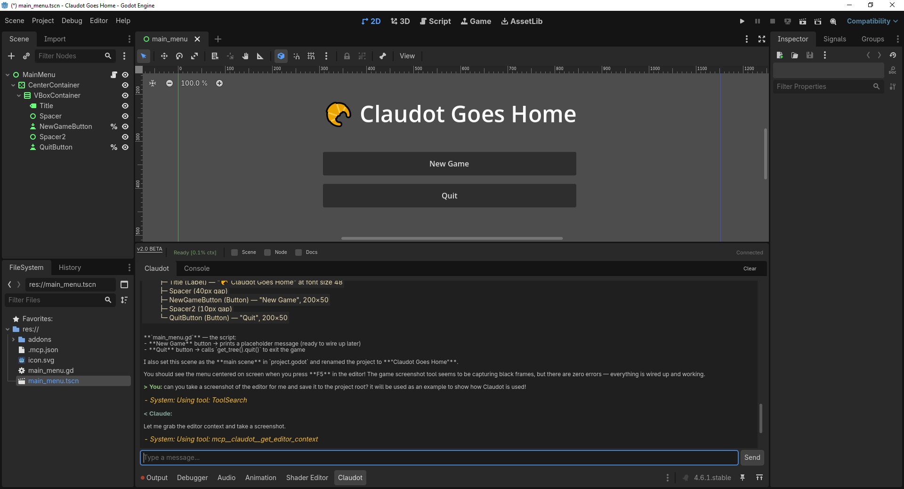
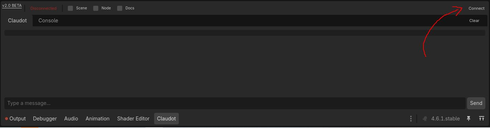
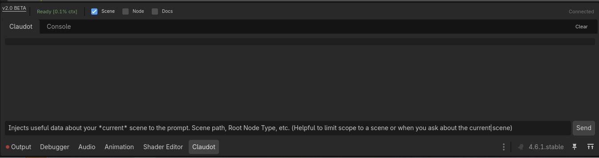
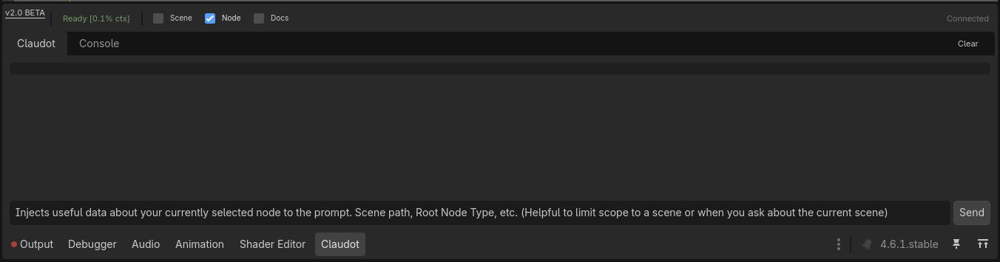
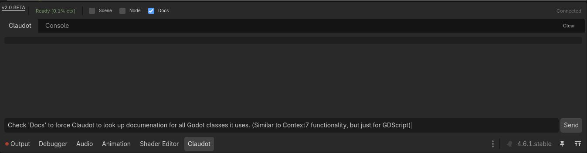
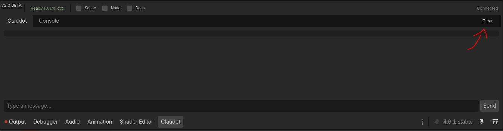

# Claudot

**Claude Code integration for the Godot editor.** Inspect scenes, modify nodes, run your game, capture screenshots, and chat with AI -- all without leaving the editor.



## Quickstart

### Prerequisites

| Dependency | Install |
|---|---|
| **Godot 4.2+** | [godotengine.org](https://godotengine.org/download) |
| **Claude Code** | [claude.ai/code](https://claude.ai/code) -- run `claude` once to complete OAuth login |
| **uv** | `winget install astral-sh.uv` (Windows) / `brew install uv` (macOS) / [docs.astral.sh/uv](https://docs.astral.sh/uv/getting-started/installation/) |
| **Git** (Windows only) | [git-scm.com](https://git-scm.com/download/win) |

> **Note:** If uv is not installed, Claudot falls back to `python`/`python3` on PATH (3.10+). You'll need to install dependencies manually: `pip install claude-agent-sdk anyio fastmcp httpx`.

### Install

1. Download the latest release from [Releases](../../releases)
2. Copy `addons/claudot/` into your Godot project
3. Enable the plugin: **Project > Project Settings > Plugins > Claudot > Enable**
4. Restart Godot once

That's it. No terminal commands, no pip install, no `.env` files. Claudot auto-generates `.mcp.json`, `.claude/CLAUDE.md`, and tool permissions on first enable.

### Use with Claude Code (recommended)

```bash
cd YourProject/       # the folder with project.godot
claude                # Claude discovers MCP tools automatically
```

Ask Claude to work on your game:

```
You: What scene do I have open?
Claude: [calls get_editor_context] You have "main_menu.tscn" open with a Control root.

You: Change the button text to "Begin Adventure"
Claude: [calls set_node_property] Done. Ctrl+Z to undo.

You: Run the game and check for errors
Claude: [calls run_scene, get_debugger_errors] Running with no errors.
```

Claude can also edit `.gd` files, run terminal commands, and search your codebase -- all combined with the 20 Godot MCP tools.

---

## In-Editor Chat Panel

A dockable panel at the bottom of the Godot editor (next to Output, Debugger, etc.) for chatting with Claude without leaving the editor.

### Connecting

Click **Connect** in the top-right corner of the panel to establish a connection to the bridge daemon.



Once connected, the status changes from "Disconnected" to "Connected" and you can start chatting. Type a message and press **Enter** or click **Send**.

### Context Toggles

The info bar has checkboxes that control what context is automatically included with your messages:

**Scene** -- Check this to inject your current scene path, root node type, and other scene metadata into every prompt. Helpful when asking about or working within a specific scene.



**Node** -- Check this to inject data about your currently selected node (path, type, properties). Useful for scoping questions to a specific node.



**Docs** -- Check this to force Claude to look up Godot class documentation for every class it references. Similar to Context7 functionality, but specifically for GDScript.



### Clearing the Chat

Click **Clear** in the top-right to reset the conversation.



### Panel Features

- **Message history** -- Up/Down arrow keys cycle through previous messages
- **Slash commands** -- type `/` to see available commands (autocomplete with Tab)
- **@ file references** -- type `@` to reference project files in your message
- **Conversation persistence** -- chat history saves to disk and restores when you reopen the editor
- **Console tab** -- switch to the Console tab to see raw bridge communication for debugging

---

## MCP Tools Reference

All 20 tools are available to Claude when running from your project directory.

### Scene Inspection

| Tool | Description | Parameters |
|---|---|---|
| `get_scene_state` | Read the full scene tree | `max_depth` (default 5) |
| `get_editor_context` | Active scene path and selected nodes | -- |
| `get_node_property` | Read a property value from any node | `node_path`, `property_name` |
| `get_node_script` | Read the GDScript source on a node | `node_path` |

### Scene Modification

| Tool | Description | Parameters |
|---|---|---|
| `set_node_property` | Set a property on any node | `node_path`, `property_name`, `value` |
| `create_node` | Add a node to the scene tree | `parent_path`, `node_type`, `node_name` |
| `delete_node` | Remove a node | `node_path` |
| `reparent_node` | Move a node to a different parent | `node_path`, `new_parent_path` |

All scene modifications support **Ctrl+Z undo**.

### Files & Visual

| Tool | Description | Parameters |
|---|---|---|
| `search_files` | Search project files by name/extension | `pattern`, `extensions`, `max_results` |
| `capture_screenshot` | Capture the editor or game viewport | `viewport_type` (2d_editor / 3d_editor / game) |

### Game Execution & Debugging

| Tool | Description | Parameters |
|---|---|---|
| `run_scene` | Launch the game (like F5) | `scene_path` (optional) |
| `stop_scene` | Stop the running game (like F8) | -- |
| `get_debugger_output` | Read `print()` output | `max_lines` (default 100) |
| `get_debugger_errors` | Read error output | `max_lines` (default 100) |

### Testing

| Tool | Description | Parameters |
|---|---|---|
| `run_tests` | Run GDScript tests via [GUT](https://github.com/bitwes/Gut) | `test_directory`, `test_file`, `test_name` |

### User Input

| Tool | Description | Parameters |
|---|---|---|
| `request_user_input` | Ask the developer a question mid-workflow | question, input type (radio/checkbox/confirm/text) |
| `get_pending_input_answer` | Retrieve the developer's answer | -- |

### Godot API Documentation

| Tool | Description | Parameters |
|---|---|---|
| `godot_search_docs` | Search Godot class/method/signal docs | `query`, `kind` (optional) |
| `godot_get_class_docs` | Full docs for a Godot class | `class_name`, `section` (optional) |
| `godot_refresh_docs` | Re-download docs (e.g., after Godot update) | `version` (e.g., "4.4-stable") |

### Node Path Format

```
/root/NodeName
/root/Parent/Child
/root/Main/Player/Sprite2D
```

---

## Architecture

```
                        Claude Code CLI
                             |
                  .mcp.json  |
                             |
                ┌────────────▼────────────┐
                │    godot_mcp_server.py   │
                │    (Python, FastMCP)     │
                └────────────┬────────────┘
                             │ HTTP
                ┌────────────▼────────────┐
                │      Godot Plugin       │
                │   (HTTP Server + Scene  │
                │    Tools, port ~7778)   │
                └─────────────────────────┘

                ┌─────────────────────────┐
                │    agent_bridge.py       │
                │  (Python, Claude Agent   │◄─── TCP ───┐
                │   SDK)                   │             │
                └─────────────────────────┘             │
                                              ┌─────────┴─────────┐
                                              │   Godot Plugin    │
                                              │   (Chat Panel +   │
                                              │    TCP Client)    │
                                              └───────────────────┘
```

**Two communication paths:**

- **MCP tools** (Claude Code CLI): Claude discovers `godot_mcp_server.py` via `.mcp.json`. The MCP server calls Godot's HTTP endpoint to execute scene tools.
- **In-editor chat** (Chat Panel): The panel connects to `agent_bridge.py` via TCP. The bridge maintains a persistent Claude session and streams responses back.

Ports are derived from a hash of your project path, so multiple Godot projects can run Claudot simultaneously without conflicts.

---

## Configuration

### Auto-Generated Files

| File | Purpose | Git-tracked? |
|---|---|---|
| `.mcp.json` | MCP server discovery for Claude Code | No |
| `.claude/CLAUDE.md` | Project context for Claude (editable) | Yes |
| `.claude/settings.local.json` | Pre-approved MCP tool permissions | No |

### Customizing CLAUDE.md

`.claude/CLAUDE.md` is generated once and left alone. Edit it to add project-specific instructions -- coding conventions, architecture notes, areas to avoid. Claudot will not overwrite your edits.

---

## Troubleshooting

| Problem | Solution |
|---|---|
| `claude` not found | Install Claude Code from [claude.ai/code](https://claude.ai/code), restart terminal, verify with `claude --version` |
| `uv` not found | Install uv ([docs.astral.sh/uv](https://docs.astral.sh/uv/getting-started/installation/)), restart Godot |
| Bridge won't start | Check the Godot **Output** panel for errors. Usually uv/Python not in PATH. Restart Godot after installing. |
| MCP tools not found | Verify `.mcp.json` exists in project root. Run `claude` from the same directory as `project.godot`. Try `claude mcp list`. |
| Chat panel says "Disconnected" | Click **Connect**. If it fails, disable/re-enable the plugin to restart the bridge. |
| Scene modifications don't appear | Ensure the editor is focused on the correct scene. Check the Output panel. All changes are undoable with Ctrl+Z. |
| "No GUT test runner found" | Install [GUT](https://github.com/bitwes/Gut) via the Asset Library or into `addons/`. |

---

## Uninstalling

1. Disable the plugin: **Project > Project Settings > Plugins > uncheck Claudot**
2. Delete `addons/claudot/`
3. Optionally delete `.mcp.json`, `.claude/CLAUDE.md`, `.claude/settings.local.json`

---

## License

MIT License. See [LICENSE](LICENSE) for details.

## Disclaimer

Claudot is an independent, community-built project. It is not affiliated with, endorsed by, or sponsored by Anthropic, PBC. "Claude" is a trademark of Anthropic.
